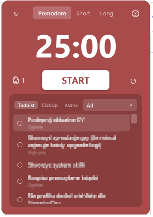

<div align="center">

# 🍅 Tiny Pomodoro

**A tiny always-on-top timer that lives in the corner of your screen.**

[](https://github.com/szejkerek/Pomodoro/releases/latest)



</div>

---

 **Distraction blocker** - while a pomodoro runs, block time-sink sites (YouTube, Facebook, LinkedIn, webmail) and kill distracting apps (Spotify). Everything comes back the moment you pause or hit a break.
 
 **Always on top** - borderless, frameless, drag it anywhere. It never gets in the way.
 
 **Your tasks, right there**  pull in tasks from **Todoist** or **ClickUp**, see due dates and status. Tick them off as you go.
 
 **Streaks & heatmap** - a focus stat view that shows when you actually get things done.

## Get started

1. **[Download the latest release](https://github.com/szejkerek/Pomodoro/releases/latest)** and run `Pomodoro.exe`.
2. Drag it to a corner. Hit **START**.
3. *(Optional)* Open settings ⚙ to connect Todoist or ClickUp.
4. *(Optional)* In settings, turn on **Block distractions** and edit the site/app lists. While focusing, those sites and apps stay blocked until you pause or take a break.

> Windows 10/11. No installer, no account, no telemetry. Your settings and tokens stay on your machine.
>
> The distraction blocker edits the Windows `hosts` file, so the app asks for **admin rights** on launch (UAC). Browsers with **Secure DNS / DNS-over-HTTPS** can bypass site blocking - turn it off there for the block to bite.

---

<details>
<summary>Build from source</summary>

Requires the [.NET 10 SDK](https://dotnet.microsoft.com/download).

```powershell
git clone https://github.com/szejkerek/Pomodoro.git
cd Pomodoro
dotnet run -c Release
dotnet test Tests\Pomodoro.Tests.csproj
```

The app is WPF on .NET 10 with a pure, unit-tested core behind platform adapters.

</details>
